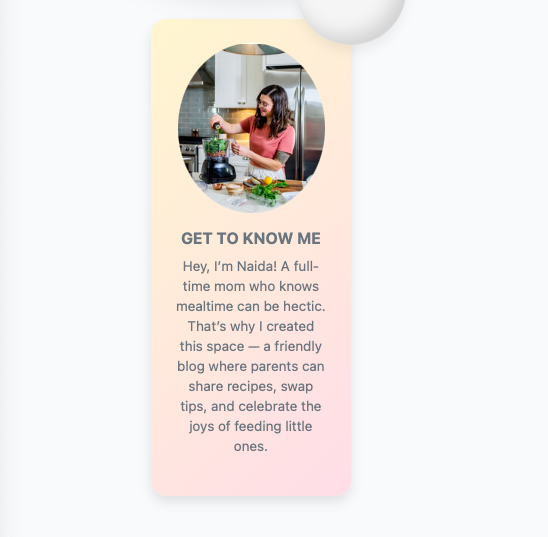

# Baby Bites

## Project Goals

**Baby Bites Blog** is a Full-Stack site designed for busy parents and caregivers who want to feed their babies well — but often don’t have the time, energy, or knowledge to prepare fresh, age-appropriate meals every day.
- Introducing solids can be confusing and stressful. Between lack of sleep, returning to work, and managing household responsibilities, many parents find themselves asking:
- What should my baby eat at this age?
- Is this food safe?
- Do I have time to make something nutritious — or will it just be another pouch?
Baby Bites was created to solve these challenges.
- This platform provides simple, fast, and nutritious recipes tailored for babies aged 6 to 12 months, so parents can feel confident about feeding their little ones — even on the busiest days.
The goals of the project are to:
- ✅ Take the guesswork out of what to cook for babies at each age stage
- ✅ Offer quick and healthy recipes using everyday ingredients
- ✅ Support parents who want to feed their babies real food but feel overwhelmed or short on time
- ✅ Reduce the reliance on store-bought baby food by making homemade meals accessible
- ✅ Empower caregivers with clear, practical feeding guidance without the stress
- ✅ Build a supportive community where users can comment on recipes, ask questions, and share their own creations
- ✅ Encourage collaboration between parents, creating a space where real-life experiences and tips can be shared openly
- By combining nutrition, convenience, and real-life practicality, Baby Bites helps parents turn mealtime into something simple, joyful, and nourishing — even when life is chaotic.

### User Stories

#### **User Stories**

**Navigation bar**
1. The navbar should be displayed on all pages, except the Login, Logout and Registration pages.
2. The navbar should include clearly labeled links (Home, About, All Recipes (with dropdown menu), Share a Recipe,  Register, Login and Logout).
3. The currently active page should be visually highlighted to help users identify their location within the site.Additionally, when hovering over Home, About, Login, Logout and Register navigation links, an animated underline should appear smoothly beneath the text to improve user experience and clarity.
The All Recipes link should have a downward arrow icon next to the label and act as a dropdown menu toggle. When clicked on the arrow, it should display a dropdown list of age-based recipe categories (e.g., 6+ Months, 8+ Months, 10+ Months, 1 Year Old). Selecting an option automatically filters the recipes on the page to show only those appropriate for the chosen age group.
4. The navigation should dynamically adjust based on the user’s authentication status:
- If the user is not authenticated: show Login and Register links.
- If the user is authenticated: show the Logout link instead.
5. The navbar should be responsive across all device sizes. On smaller screens, links should be collapsed into a dropdown (hamburger menu) for better usability.
6. All navigation links should route the user to the correct pages:
- Login, Logout, and Register should link to external pages (typically handled by Django AllAuth or similar).
- Home, About, All Recipes (dropdown menu incl.) and Share a Recipe should link to internal pages within the app.

**Login and logout**
1. Users should be able to log in using their username or email along with their password.
2. Upon successful login, users should be redirected to the homepage.
3. When a user is logged in:
- The Login and Register links should be hidden.
- The Logout link should be visible instead.
4. The navbar should clearly indicate the user is logged in by displaying their username or name.
5. Users should be able to log out from their account.
6. After logout, the user should be redirected to the homepage.
7. The login form must validate all required fields and display appropriate error messages for missing or incorrect input.
8. Failed login attempts should show clear and user-friendly error messages without disclosing any sensitive or security-related information.
9. A reminder message is displayed at the top of the page to indicate the user’s authentication status, showing whether they are currently logged in or logged out.

**Register an account**
1. The user can register an account by providing a username, email, and password.
2. The account should be created successfully only when all the entered details are valid.
3. If a duplicate email address is used, the system should display a clear error message indicating the email is already registered.
4. If any required fields are left blank, the system should prompt the user with an appropriate error message indicating which fields need to be filled.
5. Upon successful registration, the user should receive feedback confirming that the account has been created successfully.
6. Usernames should be unique across the system to prevent duplication.
7. The email address should be validated to ensure it is in the correct format and must also be unique in the system.
8. A UserProfile object (or equivalent user-related profile) should be automatically created and linked to the user upon registration.

**Logout link**
1. Allow users to navigate to the Sign Out page and they are greeted with a warm message asking if they are sure they want to log out.
2. If the user is not logged in, redirect them to the login page before allowing access to the profile.
3. Ensure the profile page is accessible only to the logged-in user, preventing other users from viewing or editing someone else’s profile.

**Admin - View Posts**
1. Admin users can see all parents posts in the system.
2. Posts should display the name of the author and date.
3. Posts should be sorted by latest and earliest.
4. Admin can filter appointments by status (pending, confirmed, completed).
5. The admin dashboard should be accessible only to staff users.

**Users**

1. Users should be logged in to be able to leave the comments and to like/unlike the recepies.

2. Non-registered Users should be able to see all the recepies, except from having access to comment and like/unlike sections.

### Future planning 

- I included - **a "Forgot your password?" option** - on the Login page which takes the user directly to the reset password page. When the users enters their email, a confirmation message appears on the page instructing them to check their email. The email should contain all the necessary information required to reset their password. At the moment, the user does not receive any email, even though the process appears to complete successfully.

- **Favorite/Bookmark Recipes** - Enable users to save their favorite recipes for later use, creating a personal collection they can easily access.

- **Advanced Search Options** - Provide advanced search features to filter recipes based on ingredients, difficulty level, cooking time, or dietary restrictions (e.g., gluten-free, vegetarian).

-**Delete comments** - Currently, users can leave comments on posts, but they cannot delete their own comments. I want to enable this functionality, so that users are able to delete the comments they have written.

### Design

#### Colour Scheme
The application uses a pink, green and grayish gradient theme throughout, maintaining visual consistency across all pages. The color palette was carefully selected using Coolers to give a professional appearance:

#### Typography
I used **Caveat**, **Segoe UI** and **Lato** Google Fonts.

- **Caveat**: Used for headings, brand elements, nutrition summary section and logo providing a casual, handwritten script font designed to feel friendly and approachable..
- **Segoe UI**: Used for password confirmation email page providing cleand and readable UI elements.
- **Lato**: Used for password reset page.

### Features Overview and Functionability testing

- **Baby Bites logo** - the logo mantains across internal pages (Home, About, All Recipe, Share a Recipe), but not across external links (Login, Register and Logout).

- **Favicon icon** - I used Favicon.io to create the favicon for the site. 

**Navigation bar** - I have a navigation bar with the following links: Home, About, All Recipes, Share a Recipe, Login, Logout, and Register.
- On the mobile version, the navigation is displayed as a burger icon/dropdown menu.

- When the user is logged in, they can add their own recipe, so the Share a Recipe and Logout links are visible.

- When the user is not logged in, the Share a Recipe and Logout links are hidden, and instead, the Register and Login links are shown.

- Each link has either an underline or hover effect (or both) to help the user orient themselves within the navigation.

**Introductory message** - This serves as a call-to-action message that enhances the design and attracts new parents to get involved.

**Hero image** - The image represents the concept of healthy food, emphasizing that for our little ones, we want only the best recipes.

**Introductory text/home page** - Displays a brief introduction to Baby Bites blog community. This section helps users understand the purpose of the page  and encourages them to engage.

**About page** - The About page features a section titled "Get to Know Me," where users are taken to learn more about the author and the inspiration behind the project. When the user clicks on the "About" internal link, they are taken directly to this section.

**All Recipes** - When we click on the "All Recipes" link (and not the arrow next to it) in the menu bar, we are taken to the All Recipes section, where all posts from both the admin and users are displayed.

**All Recipe Filter** - Users can filter all recipes by latest to see the most recently added posts first, or by earliest to view the oldest recipes at the top. This helps users easily find new additions or browse from the beginning.

**All Recipe Page Count** - On the All Recipes page, users can navigate through multiple pages of content using a pagination system. It features "Previous" and "Next" buttons, along with numbered page links (such as 1, 2, 3, 4), allowing users to jump to specific pages and browse recipes more efficiently.

**All Recipe Dropdown Menu List** - I made a dropdown menu located under the All Recipes category, which includes subcategories for 6 months, 8 months, 10 months, and 12 months.
When a user clicks on one of the options, they are taken directly to that section on the page, where only the recipes for that specific age (e.g. 6 months) are displayed.

- **Recipe** - When a user clicks on a post, the recipe opens with a detailed description. Under the recipe title, the post displays date and the author.

- At the top of the page, there is a "Back to All Recipes" button that automatically takes the user back to the main recipe page.

- **Comment Section and Like/Unlike** - When users open a recipe, the recipe description is displayed immediately. Below that, there is a like/unlike option, where registered users can like or comment on recipes made by others.
If the user is not registered, they cannot use any of those features, but they can still see how many likes or comments a recipe has. If there are no comments, a message will be displayed on the page indicating that.

**Share a Recipe** - this is a feature where users can submit their own recipes on the website, but each submission must be approved by an admin before it is published.
- Users also have the option to select the appropriate age group for which the recipe is intended. The post is hidden, until admin approves it.

**Login Hover** - When I hover over the login and register links, they change to a prominent color and display an underline.

**Login Page** -When a user is on the login page, they cannot enter the password before typing in their username, and a reminder message appears to let them know.
Login credentials are saved automatically, if the user chooses to enable that option.
If the user is not registered, there is a "Sign me up here" option that allows them to register directly from the login page, as well as a "Take me back to the home page" option to return to the homepage.

**Reset Password Page** - On the reset password page, the user enters their email. I want to include this page because I plan to have this feature fully functional in the future.
The user will receive everything they need via email in order to reset their password.
After submitting the form, a confirmation message will immediately appear, letting them know that an email has been sent to the address they entered.
- I also believe that having a "Need Support?" or "Contact Us" option is very important, as it provides a way for users to reach out if they did not receive the email or are experiencing other issues.

There is always the confirmation message after finishing the process.

**Register Page** - Clicking the registration link takes the user to an external registration page where they must provide their personal details in the required sequence.
A "Take me back home" button is available to return to the homepage at any time.
If the user is already logged in, they are automatically directed to the Sign In section instead of completing the registration form again (Username already exists.)

**Logout page** - Users can either log out or click "Take me back home" button instead.

A successful signed out message appears on the home page.

**Footer** - In the footer, there is a copyright notice and links to Twitter, Facebook, and Instagram.
Each link changes to a yellow color when clicked and directs the user to the respective external social media page.

## Testing

###
I performed manual testing on each page and feature of the app to test its functionality and responsiveness.

### Validation Tools Used
- **Python**: PEP8 compliance with proper formatting and documentation.
- **JavaScript**: JSHint validation with ES6 compatibility.
- **HTML/CSS**: W3C validation for markup and styling.

## Technologies Used

### Backend
- **Django 5.2** - High-level Python web framework that encourages rapid development and clean, pragmatic design.
- **Python 3.13.2+** - Backend programming language used with Django.
- **PostgreSQL** - Robust, scalable open-source relational database.
- **Django Allauth** - Handles user authentication, registration, and account management.
- **Django Summernote** - Text editor integrated into the Django admin for easier content creation.

### Frontend
- **HTML5** - Markup language.
- **CSS3** - For styling and layout.
- **JavaScript (ES6)** - Client-side interactivity.
- **Bootstrap 5** - CSS framework used for responsive and mobile-first design.
- **jQuery** - Simplifies DOM manipulation.

### External Services and tools
- **Cloudinary** - Cloud storage for user profile pictures.
- **Heroku** - Cloud platform for deployment.
- **GitHub** - Version control and code repository.
- **Slack/Discord** - For updates and communication.
- [Canva](https://www.canva.com/) - For Baby Bites logo image and README image.

### Development Tools
- **VS Code** - Code editor.
- **Git** - Version control.
- **PEP8** - Python style guide compliance.
- **JSHint** - JavaScript code quality tool.
- **W3C Validator** - HTML/CSS validation.

### Key Packages
- **Django 5.2.5** - Core web framework for building the application.
- **django-allauth** - User authentication
- **django-crispy-forms** - Form rendering library for better form styling.
- **crispy-bootstrap5** - Bootstrap 5 template pack for crispy forms.
- **django-summernote** - Rich text editor for admin interface.
- **cloudinary** - Cloud storage service for user profile pictures and media files.
- **dj-database-url** - Database URL configuration for Heroku deployment.
- **gunicorn** - WSGI HTTP server used to serve the app on Heroku
- **psycopg2** - PostgreSQL database adapter
- **whitenoise** - For serving static files in production
- **widget_tweaks** - Allows easier customization of form rendering

## Installation & Setup

### Prerequisites
- Python 3.13.2
- Git and GitHub account 
- PostgreSQL account
- Cloudinary account 
- Heroku account
- Environment variables

### Local Development Steps

1. **Fork and Clone the Repository**
   - **Fork the Repository:**
     - Go to the original repository on GitHub.
     - Click the "Fork" button in the top-right corner.
     - Select your GitHub account to create a fork.
   
   - **Clone Using VS Code:**
     - Open VS Code.
     - Type "Git: Clone" and select it.
     - Enter your forked repository URL: ``.
     - Choose a local folder to save the project.
     - Click "Clone".
     - VS Code will automatically open the project folder.

2. **Set Up Virtual Environment**
   - **Create Virtual Environment:**
     - Press `Ctrl+Shift+P` (Windows/Linux) or `Cmd+Shift+P` (Mac) to open Command Palette.
     - Type "Python: Create Environment" and select it.
     - Choose "Venv" as the environment type.
     - Select your Python interpreter (usually the latest version).
     - Choose ".venv" as the environment name.
     - VS Code will create the virtual environment automatically.
   
   - **Verify Virtual Environment:**
     - Check that '.venv' is displayed in the bottom information bar (on the right hand side).

3. **Install Dependencies**
   - **Install from requirements.txt:**
     - Ensure your virtual environment is activated (you should see `(.venv)` in terminal).
     - Run: `pip install -r requirements.txt`.
     - You should see a success message when installation is complete.
   
   - **Verify Installation:**
     - Run: `pip list` to see all installed packages.
     - You should see Django and other packages listed.

4. **Environment Variables**
   - **Create .env File:**
     - In VS Code, right-click in the explorer panel (left sidebar).
     - Select "New File".
     - Name it exactly `.env` (with the dot).
     - Add the following content:

import os
os.environ.setdefault("DATABASE_URL", <database_url_goes_here>)
os.environ.setdefault("SECRET_KEY", <secret_key_goes_here>)
os.environ.setdefault("CLOUDINARY_CLOUD_NAME", <cloud_name_goes_here>)
os.environ.setdefault("CLOUDINARY_API_KEY", <api_key_goes_here>)
os.environ.setdefault("CLOUDINARY_API_SECRET", <api_secret_goes_here>)

5. **Database Setup**
   - **Run Migrations:**
     - Open VS Code terminal (ensure virtual environment is activated).
     - Run: `python manage.py migrate`.
     - Wait for all migrations to complete.

6. **Create Superuser**
   - **Set Up Admin Account:**
     - In the terminal, run: `python manage.py createsuperuser`.
     - Enter a username when prompted.
     - Enter an email address when prompted.
     - Enter and confirm a password when prompted.

7. **Collect Static Files**
   - **Prepare Static Files:**
     - In the terminal, run: `python manage.py collectstatic`.
     - Type "yes" when prompted to collect static files.
     - Files will be copied to the `staticfiles` directory.

8. **Run Development Server**
   - **Start Local Server:**
     - In the terminal, run: `python manage.py runserver`.
     - You should see "Starting development server at http://127.0.0.1:8000/".
     - Open your web browser and go to `http://127.0.0.1:8000/`.
     - Your app should now be running locally.

- **Cloudinary Setup**: Sign up for a free account at [cloudinary.com](https://cloudinary.com) and get your cloud name, API key, and API secret
- **Database**: For local development, you can use SQLite (Django's default) or set up PostgreSQL
- **Static Files**: The project uses Django's static file handling with Cloudinary for media files

## Deployment

This project is deployed on [Heroku](https://www.heroku.com/). Follow these steps to deploy your own instance:

### 1. Steps for Deployment

**Install Required Packages:**
- Open VS Code terminal (ensure virtual environment is activated).
- Run: `pip install whitenoise gunicorn`.
- Run: `pip freeze --local > requirements.txt`.
- This updates your requirements.txt with the new packages.

**Create Procfile:**
- In VS Code, right-click in the explorer panel (left sidebar).
- Select "New File".
- Name it exactly `Procfile` (no file extension).
- Add this content: `web: gunicorn my_project.wsgi`.
- Save the file.

**Update Settings.py:**
- Open `my_project/settings.py` in VS Code.
- Find the `ALLOWED_HOSTS` setting and update it to: `ALLOWED_HOSTS = [".herokuapp.com"]`.
- Add this line: `CSRF_TRUSTED_ORIGINS = ["https://*.herokuapp.com"]`.
- Find `DEBUG = True` and change it to: `DEBUG = False`.
- Save the file.

### 2. Heroku Setup

**Create Heroku Account:**
- Go to [heroku.com](https://www.heroku.com/).
- Click "Sign up" and create a new account.
- Verify your email address.

**Create New App:**
- Go to your Heroku dashboard.
- Click "New" → "Create new app".
- Enter a unique app name.
- Select "Common Runtime Europe" for location.
- Click "Create app".

**Connect GitHub Repository:**
- In your Heroku app dashboard, go to "Deploy" tab.
- Under "Deployment method", select "GitHub".
- Click "Connect to GitHub".
- Authorize Heroku to access your GitHub account.
- Search for your repository and click "Connect".

### 3. Configure Environment Variables

**Get Your Values Ready:**
- **SECRET_KEY**: Generate a new Django secret key or use your existing one.
- **Cloudinary Credentials**: Get these from your Cloudinary dashboard.

**Add Environment Variables:**
- In Heroku dashboard, go to "Settings" tab.
- Scroll down to "Config Vars" section.
- Click "Reveal Config Vars".
- Add each variable one by one:
  - `DATABASE_URL`: Provided by PostgreSQL.
  - `SECRET_KEY`: Your Django secret key.
  - `CLOUDINARY_CLOUD_NAME`: Your Cloudinary cloud name.
  - `CLOUDINARY_API_KEY`: Your Cloudinary API key.
  - `CLOUDINARY_API_SECRET`: Your Cloudinary API secret

### 4. Deployment

**Deploy from GitHub:**
- In "Deploy" tab, scroll down to "Manual deploy" section.
- Select the main branch.
- Click "Deploy Branch".

Heroku deployment link: 

## Credits

### Data Sources

- **[Baby Foodie](https://babyfoode.com)- **[Healthy Mamma Kris](https://healthymamakris.com)- I was inspired by these two pages that I’ve been closely following since becoming a mom.

### Design Resources

- **[Canvas](https://canvas.com)** - Logo design and README file banner image.
- **[Pexels](https://pexels.com)** - User profile photos for testing and application use.
- **[Coolors](https://coolors.co)** - Color palette generation and selection.
- **[jQuery Timepicker](https://timepicker.co)** - Time selection plugin for appointment booking.
- **[Favicon.io](https://favicon.io/favicon-converter/)** - Favicon generation and conversion.

### Learning Resources

- **[Django Project](https://www.djangoproject.com/)** - Official Django documentation and framework.
- **[Think Therefore I Blog](https://learn.codeinstitute.net/)** - Django tutorial by code institute.

## Acknowledgements
* I would love to thank my husband for his immense support during a period that was not the easiest for anyone, especially since we were all exclusively sick for a month and a half. 
* I would also like to give a special thanks to the Student Support team at Code Institute for their incredible kindness and understanding.

